# Analysis, Classification and Generation of Movie Scripts

## Presentation of the Dataset

The study was conducted on a movie script dataset from [Kaggle](https://www.kaggle.com/datasets/bwandowando/40k-movie-scripts-from-springfield-springfield). The author created this dataset by scraping the [Springfield](https://www.springfieldspringfield.co.uk/) library. These are raw scripts, not subtitles containing the speaker's name and time. The texts contain stage directions (example: `[scream]`) as well as the release years of the movies. As a bonus, the movie genres were added by fetching them from IMDB. A genre is a category of artistic composition characterized by similarities in form, style, or subject matter (example: *comedy, romance*). A movie can have multiple associated genres. On [IMDB](https://www.imdb.com/), the data is labeled by the community but follows very [detailed](https://help.imdb.com/article/contribution/titles/genres/GZDRMS6R742JRGAG#) rules. In total, the dataset contains **37,341** scripts with genres. The IMDB synopses have also been integrated into the dataset, bringing the total number of available synopses to **11,351**.

## Dataset Preprocessing and Exploratory Analysis

In this study, two objectives were pursued in parallel: multi-label classification, where each movie can belong to several genres, and multi-class classification, which associates only one genre to each movie. The exploratory analysis was first performed on the entire multi-label corpus to identify the general trends of the language used in the scripts. The observations made on this corpus later proved to be very similar on the single-genre scripts, making it possible to apply common preprocessing decisions for both tasks. The classification was restricted to scripts having their genres in the first quartile due to a strong imbalance in class distribution (see Figure 1 and 2).

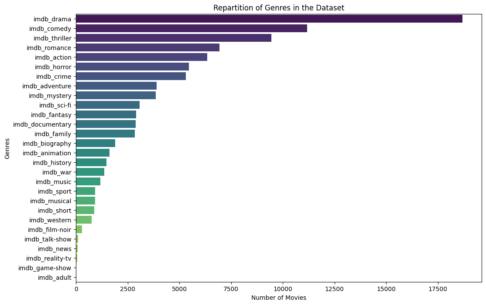
*Figure 1: Distribution of genres in the dataset*

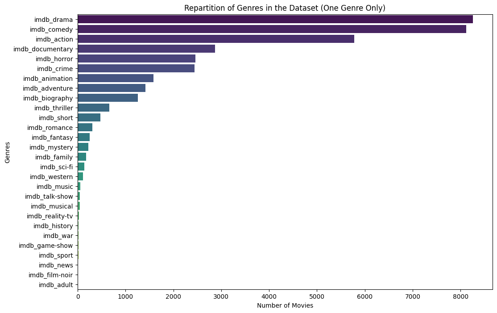
*Figure 2: Distribution of genres in the dataset (single-genre movies)*

Only the most represented genres, corresponding to the first quartile, were kept: *drama, comedy, thriller, romance, horror, documentary*. In total, the corpus contains **14,512** multi-label scripts (with one or more genres) and **7,720** single-genre scripts used for the multi-class task.

The preprocessing of the scripts initially consisted of tokenization using NLTK's `word_tokenize` and the conversion of all texts to lowercase.

The multi-label corpus contains approximately **93,895,567** tokens, divided into **573,604** unique tokens, with a maximum script length reaching **35,248** tokens. Before cleaning, the script lengths follow an approximately Gaussian distribution centered around **11,000** tokens (see Figure 3 and 4).

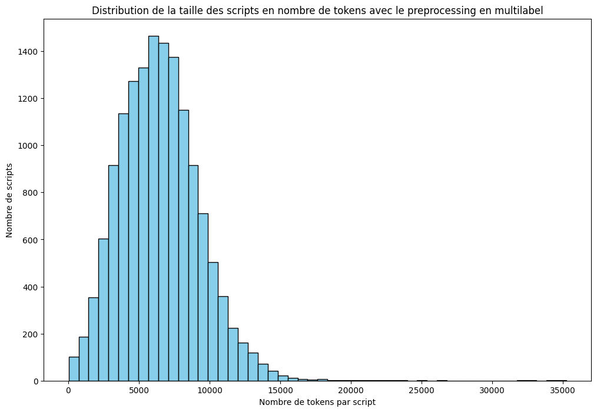
*Figure 3: Distribution of script sizes by number of tokens with multi-label preprocessing*

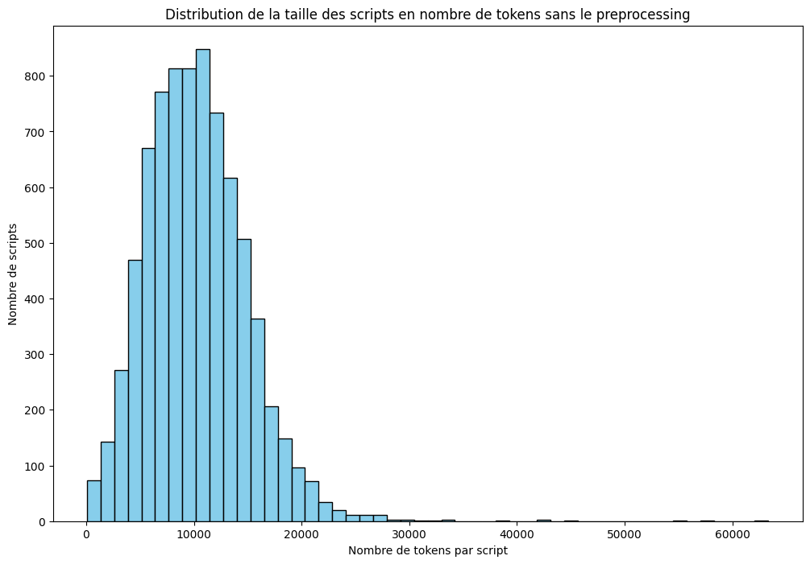
*Figure 4: Distribution of script sizes by number of tokens without multi-label preprocessing*

The analysis reveals that **46.96%** of the tokens are stop words. This observation led to the removal of stop words. After eliminating the stop words, the average script lengths recenters around **6,000** tokens, effectively reducing computational complexity without significant loss of useful information.

In the multi-class corpus, which only retains movies associated with a single genre, the statistics remain very close, although slightly lower in overall volume. There are **48,441,305** tokens, of which **345,426** are unique tokens, with the same maximum length of **35,248** tokens. The ratio of stop words is even slightly higher, reaching **48.19%**, which confirms the value of their removal in both cases. Here again, the length distribution follows a Gaussian shape similar to that of the multi-label (see Figure 5 and 6).

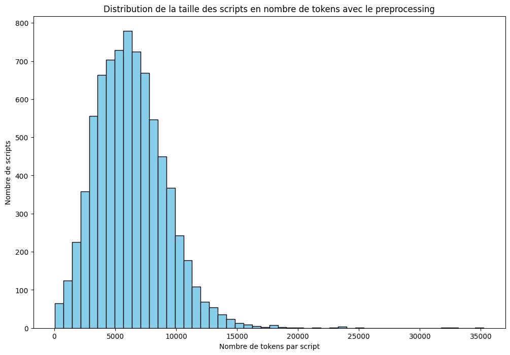
*Figure 5: Distribution of script sizes by number of tokens with multi-class preprocessing*

*Figure 6: Distribution of script sizes by number of tokens without multi-class preprocessing*

Frequency analysis of tokens in both configurations highlights the dominance of forms related to dialogues, such as contractions `"n't"`, punctuation marks (`"?"`, `"."`, `","`) or simple verbs like `"know"`, `"like"`, `"get"`. These elements reflect the conversational style specific to movie scripts, often centered on exchanges between characters.

An important observation from the cumulative vocabulary coverage curve shows that **4,024** tokens are sufficient to cover 90% of occurrences in the multi-label corpus, and **4,378** tokens in the multi-class. This highlights that a small portion of the vocabulary appears very frequently throughout the corpus (see Figure 7 and 8).

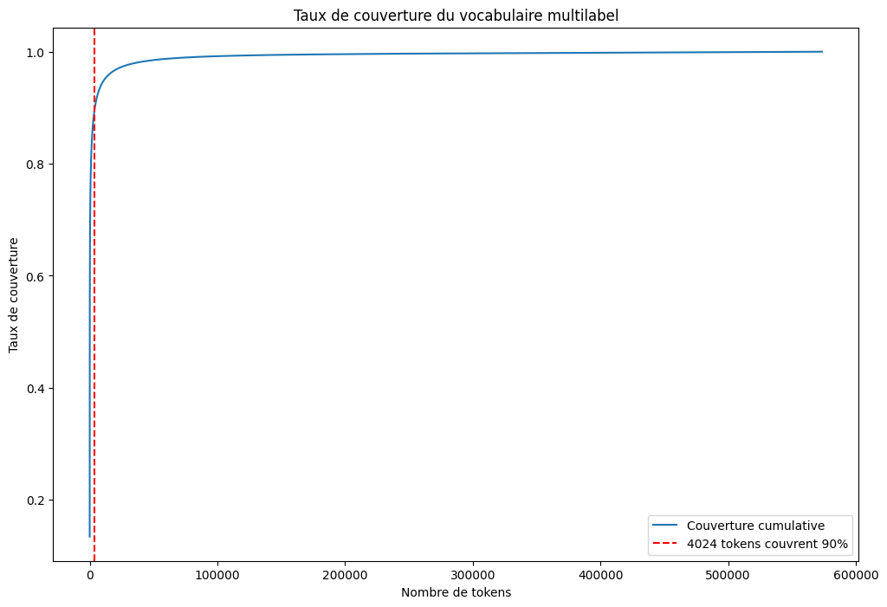
*Figure 7: Vocabulary coverage rate for multi-label*

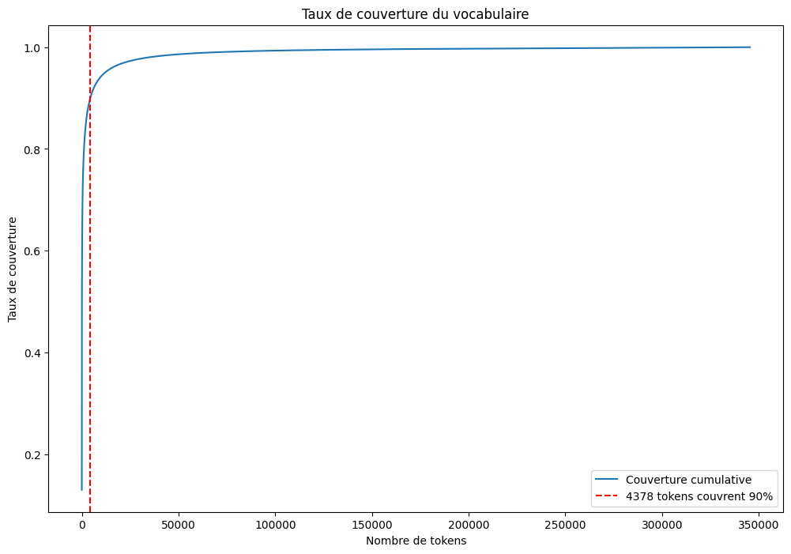
*Figure 8: Vocabulary coverage rate for multi-class*

This property could be exploited to design more compact models, by deliberately reducing the processed vocabulary to limit computational complexity. By filtering the most frequent tokens common to all classes, the classification task could also be eased by placing more emphasis on truly discriminant elements. However, this approach was not explored in detail in this study, and represents an interesting direction for future work.

Finally, in the multi-class framework, where each script is associated with a single genre, a genre-by-genre analysis reveals interesting differences in average lexical volume. Comedy, romance, and drama scripts have a higher average number of tokens, which could indicate denser storytelling or more developed dialogues. Conversely, horror or documentary scripts are more concise. These differences reflect narrative choices specific to each genre and can influence the performance of classification models if they are not correctly balanced (see Figure 9).

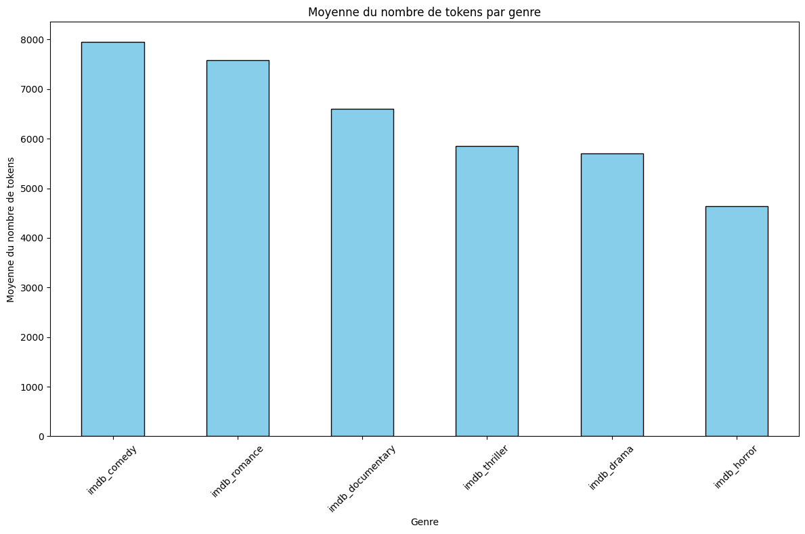
*Figure 9: Average number of tokens per genre*

## Benchmark on Classification Models

### Supervised Multi-Class Classification

| Model | Accuracy | Precision | Recall | F1-score |
| :--- | :---: | :---: | :---: | :---: |
| **Naive Bayes + Unigram** | 66 | 74 | 62 | 65 |
| **Logistic Regression + Unigram** | 77 | 77 | 70 | 73 |
| **FFNN + Word2vec** | 77 | 76 | 71 | 73 |
| **FFNN + TF-IDF** | 67 | 63 | 64 | 64 |
| **RNN + Attention** | 68 | 54 | 55 | 52 |
| **Transformers (MiniLM-L6-v2)** | 65 | 56 | 52 | 51 |
*Results of different models on movie genre classification*

For Naive Bayes and Logistic Regression models, several tokenization and n-gram configurations were tested. After evaluating different tokenizers and experimenting with unigrams, bigrams, and trigrams, it was found that using unigrams offered the best performance. Higher n-grams showed no significant improvements, leading to the selection of unigrams as the optimal configuration.

For the FFNNs, two vectorization methods were evaluated: TF-IDF and Word2Vec. Three architectures were tested. The first consists of a simple linear layer applied to the input vectors. The second adds an intermediate hidden layer with a ReLU activation to capture non-linear relationships. The third, more advanced architecture integrates normalizations (BatchNorm1d) and Dropout at each step. It is the second architecture that achieved the best performance. It outperformed the third version, which seemed to suffer from overfitting: the loss on the training data was lower, but the model generalized poorly on the test data. The second architecture offered a better compromise between learning capacity and generalization, and was therefore selected.

When training RNNs, several strategies were explored to handle the large size of the scripts. Since it was impossible to load everything into memory, a generator was initially used to dynamically load and vectorize the sequences. However, this approach led to very high training times and limited performance. To address this, the sequences were shortened so they could fit entirely into memory and leverage the GPU. While this solution sped up training, it came at the expense of result quality, due to a loss of contextual information. Another approach tested involved using the shorter movie synopses, but their insufficient number in the dataset led to underfitting and unsatisfactory results. On the other hand, incorporating an attention mechanism within the RNN made it possible to effectively process long sequences while significantly improving the model's performance.

Finally, for the Transformer, it was trained using the All-MiniLM-L6-v2 architecture from the sentence-transformers library. Scripts had to be truncated to comply with the model's input limits and the performances obtained are similar to the RNN.

### Supervised Multi-Label Classification

| Model | Accuracy | Precision | Recall | F1-score |
| :--- | :---: | :---: | :---: | :---: |
| **Naive Bayes + Unigram** | 12 | 52 | 72 | 60 |
| **OneVsRest + TF-IDF + LinearSVC** | 34 | 77 | 59 | 66 |
| **OneVsRest + Doc2Vec + LinearSVC** | 32 | 75 | 62 | 68 |
| **FFNN + TF-IDF** | 30 | 74 | 57 | 63 |
| **FFNN + Doc2Vec** | 36 | 74 | 67 | 70 |
| **RNN + Attention** | 30 | 71 | 50 | 56 |
| **MultiKNN + TF-IDF** | 18 | 61 | 21 | 24 |
| **MultiKNN + Doc2Vec** | 20 | 70 | 35 | 43 |
| **Transformers (MiniLM-L6-v2)** | 29 | 54 | 39 | 43 |
*Results of multi-label models on genre classification*

Regarding multi-label classification, here again, the optimal configuration chosen in Naive Bayes is the unigram. For feedforward neural networks (FFNN), two vectorization methods were evaluated: TF-IDF and Doc2Vec. Architectures similar to those in multi-class were tested.

### Unsupervised Multi-Class Classification

| Model | ARI |
| :--- | :---: |
| **KMeans + Sentence Transformers** | 0.037 |
| **DBSCAN + Sentence Transformers** | 0.041 |
*Unsupervised clustering results with ARI (Adjusted Rand Index)*

Further explorations in unsupervised classification were conducted. Two main approaches were evaluated to determine the hyperparameters eps and `min_samples` of the DBSCAN algorithm: analysis via the elbow method (k-distance graph) and an iterative search with manual validation. Although the elbow method provides a theoretical estimation based on the distribution of inter-point distances, the iterative search demonstrated a better fit to the specificities of the dataset. The latter approach allows progressive parameter adjustment based on the coherence of the obtained clusters, leading to a more robust segmentation of text embeddings. The weak results could be explained by a high density. An example of the closest semantic proximity captured by the all-MiniLM-L6-v2 model of Sentence Transformers is illustrated by the words "drama" and "thriller", which show a similarity of 97%. Conversely, the lowest similarity, 74%, is observed between "drama" and "sport". The idea of fine-tuning an embedding model to obtain less dense representations was abandoned due to the excessively long execution time it would imply on the available hardware.

## Dataset Enrichment

As a bonus, to increase the number of movies in the dataset, one approach consisted in exploring the creation of hybrid classes. These classes group two genres frequently associated statistically (see Figure 10) or semantically close according to their embedding distance.

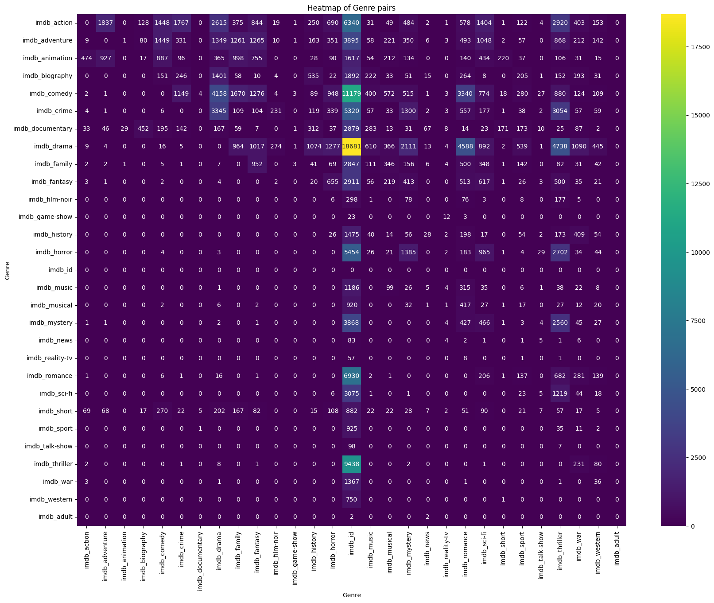
*Figure 10: Heatmap of genre pairs*

However, this method did not yield good results because the number of samples in the hybrid classes was too small.

Other approaches were therefore tested to compensate for the class imbalance in the training dataset.

Among the approaches implemented:

* **Synonym replacement**: This method involves replacing certain words in the text with their synonyms to generate lexical variation without changing the meaning.
* **Random Insertion**: Words are randomly selected and their synonyms are inserted at random positions in the text.
* **Sentence Shuffle**: the sentences are randomly reordered.

Other methods were considered, such as translation (translating a text into another language, then translating it back to English) and paraphrase generated by language models. However, due to the significant computation time required by these techniques, they were not retained in this work.

Despite these augmentations, the results obtained after augmentation did not show a significant improvement in the model's performance. The precision, recall, or F1 scores generally varied very little, and in some cases, the augmentation even degraded performance. This can be explained by an augmentation that is not very relevant semantically, or by the introduction of noise in the augmented data.

In order to improve prediction, another approach was to remove the "drama" class, which caused a lot of confusion in the model. It is the class most associated with other genres and the closest semantically to the others, especially comedy, thriller, and romance. Although the results were slightly better for the remaining classes, this approach was not retained because the overall metrics dropped, due to a decrease in the total number of scripts. In particular, the "crime" class, which replaced "drama" in this method, contributed to the decrease in results due to an insufficient number of scripts.

## Benchmark on Text Generation Models

| Model | BLEU | ROUGE-L | BERTScore F1 | BERTScore P | BERTScore R |
| :--- | :---: | :---: | :---: | :---: | :---: |
| 5-Gram + 50 tokens generated | 0.0220 | 0.1091 | 0.3670 | 0.3641 | 0.3691 |
| Feedforward Neural Network (Dense + Norm) | 0.0236 | 0.1182 | 0.3742 | 0.3761 | 0.3716 |
| Bidirectional GRU + Word2Vec | 0.0242 | 0.1271 | 0.3746 | 0.3709 | 0.3777 |
| Transformer GPT2 Fine-tune (AventIQ) | 0.0355 | 0.1797 | 0.3799 | 0.4091 | 0.3502 |
*Scores of text generation models*

Concerning movie script generation, several models were used: `N-gram`, `Feedforward Neural Network (FFNN)`, `Recurrent Neural Network (RNN)` and `Transformers`.

A subset of **1,000** scripts was extracted from the initial dataset, split into **800** scripts for training and **200** for evaluation. To preserve the structure of the movie scripts, a custom tokenization was implemented. This involved manually tokenizing line breaks, absent in **NLTK**'s `word_tokenize` function, before applying `word_tokenize`. This step helps maintain the readability and structural layout of the movie scripts.

Several **n-grams** were evaluated: unigrams, bigrams, trigrams, 4-grams and 5-grams, over varying script lengths (`generating 50 tokens and 100 tokens`). The `BLEU`, `ROUGE-L` and `BERTScore` results showed that the unigram produced particularly weak results, failing to form coherent sentences. The models starting from the trigram present a slight improvement, with the 5-gram being slightly superior. Overall, however, n-grams capture neither style nor context, and merely reproduce word sequences frequent in the corpus.

Regarding **FFNNs**, they were trained on a corpus of **50,000** sequences of **20** words, using Word2Vec vectors as a semantic representation. Three variants were tested: a single dense layer network, a 2 dense layer network, and a version with `Layer Normalization` and 2 dense layers. The latter proved to be the best performing of the three. Nonetheless, the results achieved are quite similar to those of the n-grams for the `BLEU` and `ROUGE` metrics. `FFNNs`, due to their non-sequential structure, struggle to generate grammatically valid sentences and to model context, keeping their application limited for coherent movie script generation.

For the **RNNs (GRU, LSTM)**, they were trained on the same Word2Vec representations. The scores obtained with RNNs stay close to those of n-grams. These scores can be explained by several factors: an input that is too short (50 tokens as a prompt), and hardware constraints that didn't allow for hyperparameter optimization or training on longer sequences (increasing epochs, considering more scripts, etc.). Introducing bidirectionality `(Bi-GRU, Bi-LSTM)` allowed a slight improvement, particularly in the BERT-Score.

**Transformers**, specifically those based on `GPT-2`, displayed the best performances among all models. The `GPT-2` model, pre-trained on generalist corpora, already outperforms all other architectures across the three employed metrics `(BLEU/ROUGE, BERT)`. Fine-tuning `GPT-2` on the specific movie script corpus `(AventIQ model)` improved `BLEU` and `ROUGE` scores. The `DistilGPT2` model used by yroshan, pre-trained on movie script corpora, showed performances close to those of `GPT-2` while being lighter **(88 million parameters versus 137 million for `GPT-2`)**. Thus, pre-training on adapted corpora maximized the generation quality of movie scripts.

Overall, Transformers are substantially more capable of movie script generation. Furthermore, it's vital to note the limitations of BLEU/ROUGE scores which predominantly measure the lexical accuracy of the generated sequences. Consequently, these indicators may underestimate the quality of certain generations which, while semantically relevant, feature different wording.

Being constrained by the available `RAM` to run the models, further enhancement possibilities could be: increasing the number of movie scripts in the corpus (to allow vocabulary variety), expanding the number of sequences used for model training (currently limited to **50,000** sequences of **20** words), and escalating the prompt size (currently limited to **50** tokens) so that the model can access more context and thereby generate more pertinent sentences.

## Analysis of Homosexual Representation in Comedies over the Years

In a complementary exploratory approach, inspired by the methodology employed by Himmler in his study "Diachronic Word Embeddings Reveal Statistical Laws of Semantic Change", the evolution of homosexual representation in cinema was scrutinized through the scripts dataset. The analysis focused on the semantic trajectory of the word `"gay"` within the scripts over several decades.

Comedies were chosen as the primary study corpus due to the high frequency of the term `"gay"` in this genre (see Figure 12). Even though the dataset features an uneven distribution of movies before and after the year **2000** (see Figure 11), significant outcomes were identified.

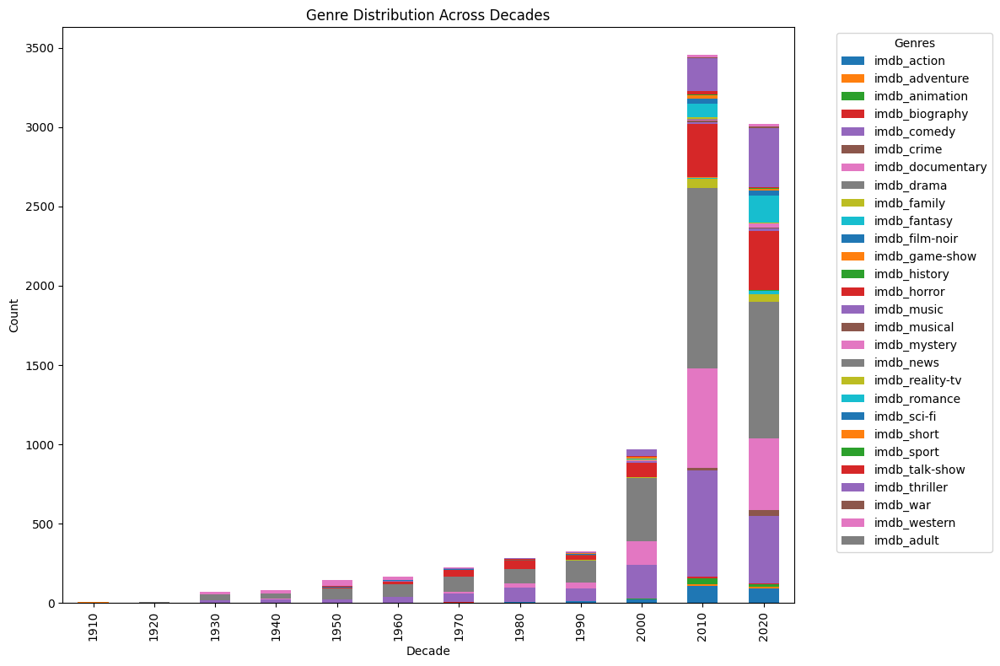
*Figure 11: Distribution of genres over the decades*

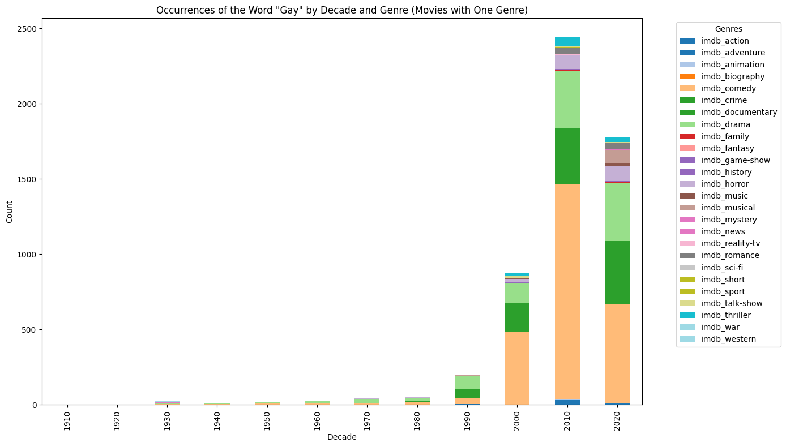
*Figure 12: Occurrence of the word "gay" over the decades (single-genre movies)*

Moreover, a notable surge in the frequency of the word `"gay"` is observed from this period onwards, a phenomenon that could potentially indicate cultural invisibilization, to be explored subsequently.

To grasp the semantic nuances linked to the word `"gay"` across the decades, script tokens were embedded into a vector space using the Word2Vec model. An analysis of the words most similar to `"gay"` was conducted for each decade. It was found that in the **1930s**, the term `"gay"` was mainly utilized in its literal sense, denoting joy. Between the **1930s** and **1990s**, a gradual semantic progression towards a sexual connotation was witnessed, highlighted by the emergence of the word `"relationship"` among the most analogous terms. However, negatively connoted words like `"upset"`, `"confused"` and `"dead"` were also associated. The period spanning **1990** to **2000** marked a deep acceleration of this semantic shift. The term `"gay"` materialized as an insult in the comedies of the **2000s**, deployed in contexts akin to deregatory terms such as `"retarded"` and `"dumb"`. From the **2010s** onwards, the advent of technical terms like `"bisexual"` and `"queer"` was recorded.

While this subject would warrant an extensive breakdown in a dedicated report, inclusive of a parallel with the historical context of each decade, the impact of the legislative leaps and the queer movements of the **2010s** upon a less homophobic representation of homosexuals is evident, despite the persistence of ground left to cover.

## Conclusion

Upon completion of this study, both the classification and generation of movie scripts were deeply investigated using a large, compiled, and detailed corpus. The dataset analysis showcased the linguistic singularities of scripts, encompassing heavy dialogue usage, condensed vocabulary, and distinctive disparities between genres. These findings steered the preprocessing decisions and drove the optimization of model performances.

In supervised classification, classic frameworks such as logistic regression or straightforward neural networks yielded the highest achievements. Conversely, more cutting-edge architectures models like `Transformers` or `RNNs` failed to provide significant gains, primarily due to hurdles surrounding script length and hardware confines. Unsupervised classification outcomes remained meager, hinting at a robust semantic homogeneity among genres that obstructs automatic segmentation.

Data augmentation initiatives and class restructuring efforts did not visibly bolster performance, highlighting the bounded capacity of certain enrichment means when the underlying data is pre-skewed or noisy. Lastly, throughout the text generation task, while generated scores remained modest, fine-tuning the `GPT-2` model showcased an intriguing aptitude in crafting coherent output stylistically analogous to authentic scripts.

Additionally, to render script generation utilities accessible and interactive, an extra web platform was constructed. This site delivers the capability to generate movie script sequels driven by the trained models.

This research paves multiple pathways for ensuing work: polishing embeddings through supervised fine-tuning, leveraging summaries or metadata to bolster context, or even merging classification tasks with multi-modal approaches weaving in visuals or audio.

